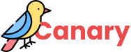

# Canary (IvyHacks'20)

Alough restrictions are being lifted, we know the world will never be the same.
We hesitently and cautiously approach the public but remain shrouded in uncertainty. 
With the most recent community constructed feedback, **Canary** (like a canary in a coal mine) 
is built with the goal for you to make more confident judgements on where
you or loved ones can safely and comfortably go in public ahead of time.

It's vital that businesses and public spaces open safely and responsibly.   
**Help your community revival and encourage safe practices by leaving a quick review!**
####Let's rebuild the global community *together*.

